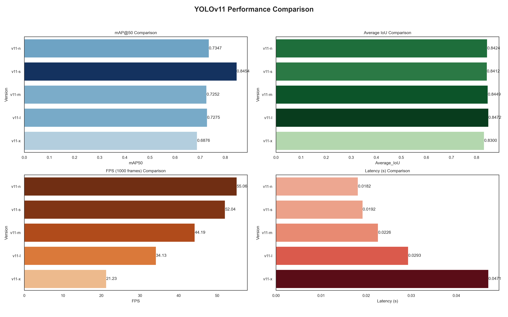

# Accident_Detect

Mô hình nhận diện tai nạn giao thông tại Việt Nam

---

## 🖥️ System Information

**Operating System**: Windows 11 (Build 22631)  
**CPU**: 12th Gen Intel(R) Core(TM) i7-12700H  
**CPU Cores**: 14  
**CPU Threads**: 20  
**Max CPU Frequency**: 2700.00 MHz  
**RAM**: 15.71 GB  

---

## 🎮 GPU Information

**GPU**: NVIDIA GeForce RTX 3050 Ti Laptop GPU  
**GPU Memory**: 4.00 GB  

---

## 🧪 Software Versions

**Python**: 3.12.8  
**Torch**: 2.7.1+cu128  
**CUDA Available**: ✅ True

---

## 📊 Evaluation Result

---

## 📥 Dataset

You can download the dataset here:  
🔗 [https://app.roboflow.com/convertyolo2voc/convert_yolo_2_voc/1](https://app.roboflow.com/convertyolo2voc/convert_yolo_2_voc/1)

---

## 📄 License

This project is for educational and research purposes only.
